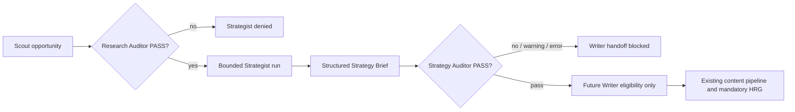

# Strategist + Strategy Auditor V1 Architecture

## Status and scope

This document defines a **bounded, evidence-backed Strategist plus independent Strategy Auditor** for The Business Manager Founder Preview. It is a non-merging implementation plan and does not authorize production deployment, billing, autonomous schedules, automatic publishing, or bypass of the Human Review Gate.

> **V1 operating rule:** Scout may discover an opportunity, but only an opportunity with a latest Research Auditor state of `pass` may enter Strategist. A Strategy Brief may reach a future Writer handoff only after an independently created Strategy Auditor state of `pass`. `pass_with_warning`, `blocked`, `error`, and `not_run` are downstream-blocking states.

## Capability matrix

| Capability | State | V1 treatment |
|---|---|---|
| Workspace-scoped RLS, membership guards, audit attribution | **EXISTS** | Reuse established workspace mixins, RLS policies, scoped route dependencies, and direct-RLS regressions. |
| Scout opportunities, source provenance, evidence links, Research Auditor | **EXISTS** | Source inputs are limited to opportunities whose latest Research Auditor is exactly `pass`. |
| `strategist_gate` upstream eligibility | **EXISTS** | Reuse as the exclusive Scout-to-Strategist gate. No alternate route may accept unapproved opportunities. |
| Durable outbox, idempotency, bounded retry, recovery/DLQ | **EXISTS** | Emit lifecycle events atomically and reuse existing bounded recovery mechanics. |
| Spend caps, reservation, commit, release, provider usage | **EXISTS** | Reuse only when an approved configured provider makes a chargeable call. Provider-not-configured V1 runs make no call and reserve no spend. |
| Content topics, hooks, scripts, CTA, immutable versions | **PARTIAL** | Use for structural anti-repetition comparisons; no semantic or fabricated similarity model. |
| Publication originality fingerprint | **PARTIAL** | Applies downstream at publication. Add a strategy-brief structural fingerprint before Writer. |
| Human Review Gate / exact reviewed version binding | **EXISTS** | Remains unchanged. Strategy approval never approves content or publishing. |
| Worker registry and assignments | **EXISTS** | Record worker attribution; do not add a new autonomous Strategist executor in this preview. |
| Provider credential storage | **PARTIAL** | Storage is available, but no Strategist model/provider capability is configured. |
| Business Brain objectives, audience rules, platform rules, capability profile | **MISSING** | Profile contains identity only. Strategy requests must return `BUSINESS CONTEXT INCOMPLETE`; no goal or rule is assumed. |
| Historical performance, revenue attribution, prior strategy outcomes | **MISSING** | Display `NO DATA`; do not score or predict performance. |
| Semantic originality model and embedding index | **MISSING** | V1 uses deterministic structural fingerprints and explicit overlap reasons only. |
| Autonomous research/strategy scheduling | **DEFER** | Persisted schedules remain disabled by default. No preview background cycle is enabled. |
| Writer/Producer execution handoff | **DEFER** | V1 can expose a strict eligibility state only. No new Writer call, copy generation, Provider invocation, or publishing occurs. |

## Data model

All records are workspace-scoped, versioned where mutable, audit-attributed, and protected by RLS.

| Record | Purpose | Key fields |
|---|---|---|
| `strategy_runs` | Bounded manual Strategist request and accounting envelope | `workspace_id`, `strategy_objective`, `source_opportunity_ids`, `max_tokens`, `max_provider_calls`, `max_cost_usd`, `deadline`, `max_attempts`, `status`, `provider_state`, usage/cost counters, correlation/trace, `test_data` |
| `strategy_briefs` | Structured recommendation, never a performance guarantee | Required brief fields from the directive; source links, evidence summary, confidence, priority, risk/cost/capability state, structural fingerprint, status, worker/run attribution, `test_data` |
| `strategy_brief_opportunities` | Immutable source-opportunity provenance links | `workspace_id`, `strategy_brief_id`, `opportunity_id` |
| `strategy_audits` | Independent examination of stored brief and inputs | `workspace_id`, brief/run IDs, state, snapshot, findings, warnings, blocked reasons, repetition reasons, checked timestamp, `test_data` |
| `strategy_schedules` | Future scheduling intent | one workspace schedule, `enabled=false` default, frequency, next-run, attribution |

No record stores provider secrets, raw untrusted source text beyond the safe Scout provenance contract, credentials, password values, or fabricated performance data.

## Bounded execution and truth states

A manual run requires workspace ID, explicit strategy objective, source opportunity IDs, deadline, token/call/cost limits, and maximum attempts. Defaults are conservative: **five source opportunities, 4,000 tokens, five provider calls, zero preview provider budget, and three attempts**. The provider state defaults to `not_configured`, so no provider call, spend reservation, retry, or artificial brief is created.

The explicit visible states are:

| Condition | Required state |
|---|---|
| No strategy provider/capability | `STRATEGY PROVIDER NOT CONFIGURED` |
| Missing workspace objectives/rules | `BUSINESS CONTEXT INCOMPLETE` |
| No historical performance | `NO DATA` |
| Unknown production price | `COST UNKNOWN` |
| Required production capability absent | `BLOCKED — REQUIRED CAPABILITY NOT CONFIGURED` |
| Latest Research Audit is not pass | `DOWNSTREAM BLOCKED — RESEARCH AUDIT NOT PASS` |
| Strategy audit warning, block, error, or not run | `DOWNSTREAM BLOCKED — STRATEGY AUDIT NOT PASS` |
| Equivalent structural brief exists | `DUPLICATE — REUSE OR REVISE` |

## Independent-gate flow

Strategist cannot set a Strategy Auditor pass. Strategy Auditor receives a persisted brief snapshot and independently evaluates evidence traceability, objective completeness, Business Brain conflict state, structural overlap, estimated/unknown cost, configured capability requirements, unsupported assumptions, and specificity for a future Writer/Producer. A warning cannot silently become a downstream approval.

## Anti-repetition and deduplication

The V1 structural fingerprint normalizes source opportunity IDs, objective, target platform, content format, creative angle, hook direction, CTA direction, and business goal. It is compared within the workspace against active and recent Strategy Briefs. Exact structural duplicates are not recreated; the service returns the existing brief or marks a duplicate with a durable event. Content topics, hooks, scripts, and formats are inspected for explicit overlap reasons. Without a configured semantic similarity model, V1 does **not** claim semantic novelty.

## Financial awareness and feasibility

A Strategy Brief contains a cost state, complexity, required assets, production requirements, rights/compliance requirements, and capability checks. Existing workspace caps are enforced for future chargeable provider work. V1 makes no cost estimate without provider price evidence and does not reserve funds when no provider is configured. Missing video, image, TTS, rendering, or platform-format capability blocks downstream eligibility rather than passing a non-executable plan to Writer.

## Events, retries, and governance

The service emits durable, workspace-scoped events for opportunity acceptance, strategy start, brief creation/update, duplicate detection, budget/feasibility block, audit start/pass/warning/block/error, retry, error, and future Writer eligibility. Existing idempotency, retry backoff, and dead-letter behavior are reused; Strategy Auditor is never skipped after retry exhaustion.

Strategy records must be classified in the existing data-governance export/deletion registry. Source and audit provenance remain preserved through deletion processing according to the existing research-evidence policy.

## Founder Preview boundary

The Founder Preview exposes real schema, gates, summaries, empty/provider-not-configured views, and **explicitly labelled test-only fixture transitions**. It does not execute live strategy inference, claim a recommendation is performant, access external platform data, enable schedules, create final copy, publish, approve Human Review, or invoke unconfigured providers.

## Test requirements

Targeted tests must cover RLS isolation through the API and direct scoped database session; Scout-audit rejection; Strategy Auditor non-bypass; repetition/deduplication; missing Business Brain; missing required capability; cost/budget state; injection-safe inputs; secret redaction; retry exhaustion; idempotency; truthful provider-not-configured state; and Writer denial unless both independent gates pass. Existing API, worker, frontend, lint, build, desktop, 390px mobile, console, and overflow gates remain mandatory.
